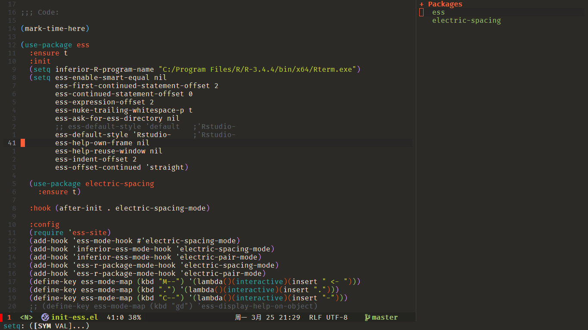
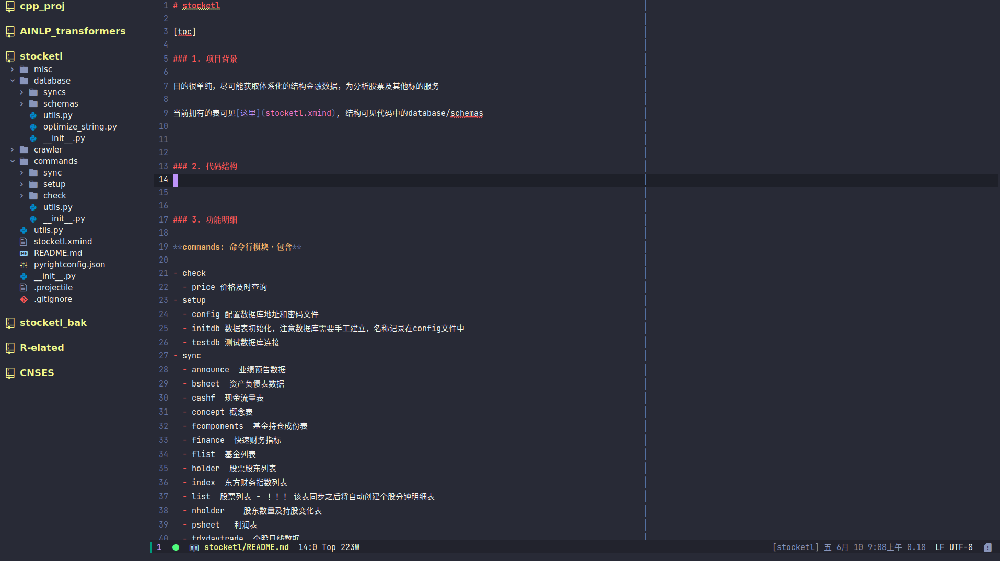
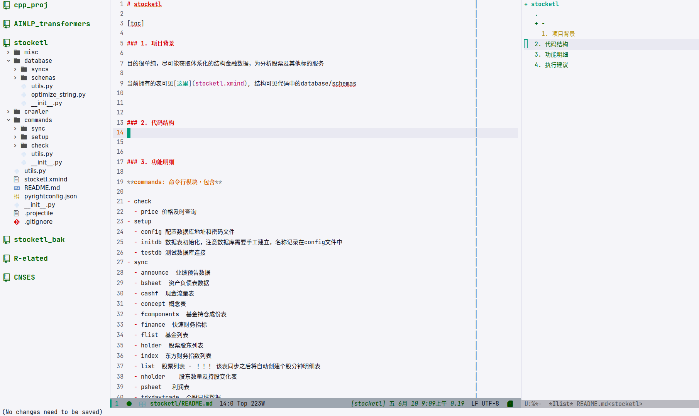

# UNICORN

## 

**UNICORN is a emacs based programming editor with vim mode and fully keyboard controller, trying to provide an immersive programming experience, enjoy it !**

Note: strongly suggest for usage in a purly Linux environment, or in windows WSL system, ubuntu system with GUI suggested

```shell
# start in GUI system, suggested
> emacs

# start in TUI system
> emacs -nw
```


## 1. Prerequisites

- install prebuild [emacs](https://www.gnu.org/software/emacs/) from snap, or build from [source](https://www.gnu.org/software/emacs/manual/html_node/efaq/Installing-Emacs.html), emacs 29.0 + suggested, proxy (SSR or Clash) suggested if you are in china

- OR build and compile from source, tested in windows 11 WSL[ubuntu]

```shell
# close ssr agent first!!!, recommend this way, installed pre-compiled
> sudo add-apt-repository ppa:ubuntu-elisp/ppa
> sudo apt-get update
> sudo apt install emacs-snapshot

<!-- start -->
# build from source
git clone https://github.com/emacs-mirror/emacs.git
sudo apt install build-essential libgtk-3-dev libgnutls28-dev libtiff5-dev libgif-dev libjpeg-dev libpng-dev libxpm-dev libncurses-dev texinfo
sudo apt install libjansson4 libjansson-dev
# Native Complilation
sudo apt install libgccjit0 libgccjit-10-dev gcc-10 g++-10
export CC=/usr/bin/gcc-10 CXX=/usr/bin/gcc-10
cd emacs
./autogen.sh
./configure --with-native-compilation --with-json --with-pgtk --with-modules CFLAGS="-O2 -mtune=native -march=native -fomit-frame-pointer" prefix=/usr/local
    make -j$(nproc) NATIVE_FULL_AOT=1
<!-- end -->

# make sure git add proxy before installing, especially usefull for emacs quelpa mechanism
> git config --http.proxy http://127.0.0.1:1080
> git config --https.proxy https://127.0.0.1:1080

# if needed to store user.name and password for convenient usage
> git config --global user.name xxx
> git config --global user.email xxx
> git config --global credential.helper store

  - [Fira Code](https://github.com/tonsky/FiraCode)
  - [Fira Code Symbol](https://github.com/tonsky/FiraCode/files/412440/FiraCode-Regular-Symbol.zip)

- global tools and frameworks

```shell
# ripgrep, usefull when you want to lightening search anything projectively wide
# make sure rg is in your system env
> sudo apt install ripgrep
```

- language supported
- Python packages suggested, if you work with python

```shell
> pip install black \ # autoformat code
			yapf \  # 
			isort \ # 
```

- R language server suggested, if you work with R

```shell
# add Rterm to system path first and open R in terminal
install.packages("devtools")
devtools::install_github("REditorSupport/languageserver")")
```

- Markdown support

```shell
> sudo apt install markdown grip
```

- C/C++ package suggested, if you work with C/C++

```shell
# sudo apt install g++ cmake
# language server LSP will automatically install clangd later
```

- CMAKE support

``` shell
# suggest you have python3 installed in you system environment
<!-- language server -->
pip install cmake-language-server

<!-- formatter -->
pip install cmake-format
```

- nodejs packages suggested, this is important, as emacs language server use a lot of it

```shell
# install nvm, ref: https://github.com/nvm-sh/nvm#installing-and-updating
# install node lastest version
> nvm install node

# add sudo or change dir with chown -R if no permission
> npm install -g eslint_d prettier markdownlint-cli vmd

# install formatter for markdown
> sudo npm install --global prettier @prettier/plugin-lua @prettier/plugin-php prettier-plugin-solidity prettier-plugin-toml

# install npm and set taobao proxy, install nodejs from here -> https://nodejs.org/en/
> npm install -g cnpm --registry=https://registry.npmmirror.com
> echo "alias npm=cnpm" >> ~/.zshrc
```

- vterm shell, if you want to integrate a better Linux shell to emacs
  - only for \*nix system, refer [here](https://github.com/akermu/emacs-libvterm)

```shell
> sudo apt install cmake
> sudo apt install libtool
> sudo apt install libtool-bin
```

- put `.zshenv` in home folder, do not forget to add to `exec-path-from-shell-variables`

``` shell
# put it in ~/.zshenv
export WORKON_HOME='/home/user/miniconda3/envs'
[[ -s $HOME/.nvm/nvm.sh ]] && . $HOME/.nvm/nvm.sh  # This loads NVM

# R env
# export R_LIBS_USER="/mnt/UbuData/Rpkgs_nonshiny"

# GOlang
GO_HOME=/home/linyi/go
export PATH=$GO_HOME/bin:$PATH

# better performance for lsp
export LSP_USE_PLISTS=true
```

-- use mirror if you come across timeout error.


## Install UNICORN

- clone from git

```shell
> git clone https://github.com/peter159/unicorn.git ~/.emacs.d
```

For server user, since emacs is running a deamon for server, make a short cut applying something like the follows to use it (change the path to your path). Look at [wiki](https://www.emacswiki.org/emacs/EmacsMsWindowsIntegration) to see the explanation of how emacsclient works

- make shortcut for system

```shell
# add proxy to emacs
> vim ~/.emacs.d/init.el
# find line 31, change global-httpproxy setting to yours
;; set http proxy, not need when set `git config --global http.proxy' in terminal
(defvar global-httpproxy "127.0.0.1:1008")
(setq url-proxy-services `(("http" . , global-httpproxy)
			   ("https" . ,global-httpproxy)
			   ("no_proxy" . "^\\(localhost\\|192.168.*\\|10.*\\)")))


# create a new shortcut(recommended)
> vim /usr/share/applications/emacs-server.desktop

# modify a existing shortcut
> vim /snap/emacs/current/meta/gui/emacs.desktop

[Desktop Entry]
Encoding=UTF-8
Name=emacs-server
Comment=Emacs IDE
Exec=/usr/bin/emacsclient -cna emacs
Icon=emacs  
Terminal=false 
StartupNotify=false
Type=Application
Categories=Development;TextEditor;
```

- fire it up, all emacs related necessary packages will be installed automatically, enjoy it !

```shell
> emacs
```

- issues
  - if you come across symbol or fonts displaying issue, open emacs, run command M-x, all-the-icons-fonts-install 
  - if you find vterm not compiling, go to `~/.emacs.d/elpa/vterm-20220429.21/build/` and run:

	``` shell
	> cmake ..
	> make
	```


### KEYBOARD Control Shortcut List

I don't plan to add them one by one as brochure at least for now, but you can explore them yourself,
by using [**SPACE**] keyboard. You can also read from source code `~/.emacs.d/lisp/leader-key-binding.el`


## SNAPSHOT

## 

## 

## 

## Notes

- tested in emacs 28.05, Ubuntu 20.04, 20210116
- tested in emacs 27.1, windows 10, 20210117, can also download and use unicorn-windows repo as well
